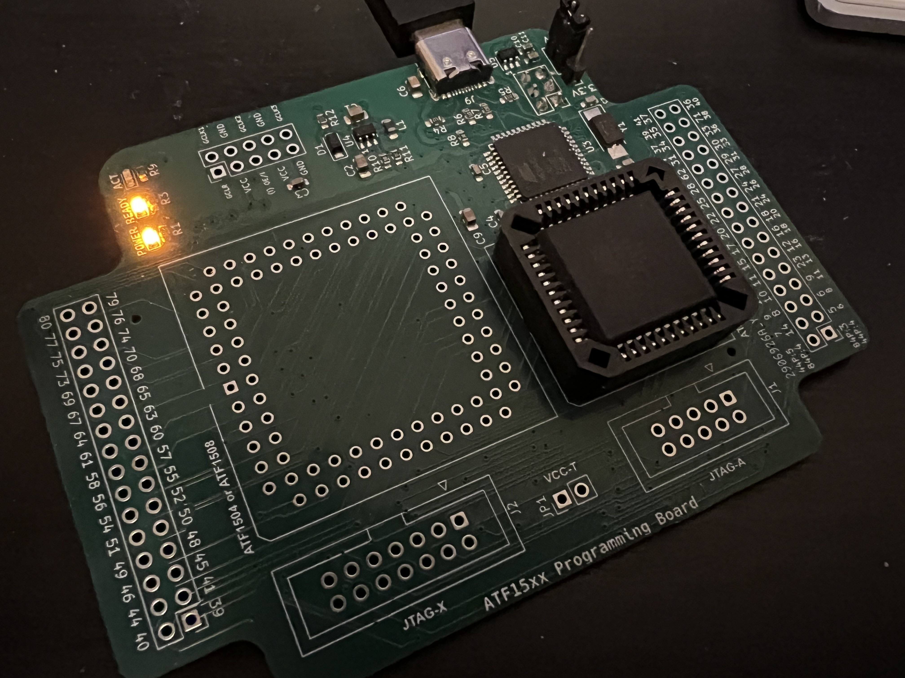

# Little ATF150x Programmer Board
## Software utilities

### What

This repository contains the official standard programmer software and utilities 
for the Little ATF150x Programmer Board.



This is a plug-and-play USB-connected programmer and breakout board for
Atmel (Microchip) ATF150{2,4,8} CPLDs, featuring:

* Support for JED, SVF or XSVF files
* Support for both PLCC44 and 84 packages on-board
* Ability to drive ICSP via the JTAG headers (single-device only - chains **not** currently supported)
* Ability to erase JTAG-locked and secured devices

The board is currently in community testing, and will be available soon 
on the [rosco_m68k store](https://store.rosco-m68k.com) 🥳

### Software Installation

> **Note** pypi installation **coming soon**!

Requirements: Python 3.9+ and the libraries in `requirements.txt`.

```shell
pip install .
```

If you're developing this, you'll probably want to install it `--editable`.

### Usage

#### General arguments

General command line arguments look like this:

```
atfu [-h] [--version] [-q] [-v] [-t] {program,erase,check,programmer} ...

Little ATF150x Programmer Board Utility

positional arguments:
  {program,erase,check,programmer}
    program             Program an ATF150x device
    erase               Erase an ATF150x device
    check               Check if an ATF150x device is blank
    programmer          Little ATF150x Programmer Board device functions

optional arguments:
  -h, --help            show this help message and exit
  --version             show program's version number and exit
  -q, --quiet           Silence almost all output
  -v, --verbose         Allow additional output
  -t, --trace           Enable debugging output (can be noisy!)
```

#### Program mode

This mode is used to program JEDEC, SVF or XSVF files to an ATF150x device.

By default, the first detected programmer will be used. This can be changed
with the `-p` option.

If you have problems programming, try erasing first with the `-e` option,
or force-erasing with the `-f` option, which can be useful when you have a
JTAG-locked or secured device.

```
atfu program [-h] [-e] [-f] [-d {ATF1502,ATF1504,ATF1508}] [-p PROGRAMMER] filename [filename ...]

positional arguments:
  filename              .jed, .svf or .xsvf file(s) to program

options:
  -h, --help            show this help message and exit
  -e, --erase           Erase before programming
  -f, --force           Force-erase before programming (implies -e)
  -d {ATF1502,ATF1504,ATF1508}, --device {ATF1502,ATF1504,ATF1508}
                        Device to program (default: ATF1502)
  -p PROGRAMMER, --programmer PROGRAMMER
                        Programmer device (default: /dev/cu.usbmodem14301)
```

#### Erase mode

This mode is used to erase an ATF150x device, and can also be used to 
force erase JTAG-locked or secured devices.

> **Note** that the force mode might be... _stressful_ for your device.

```
usage: atfu erase [-h] [-f] [-p PROGRAMMER] [-d {ATF1502,ATF1504,ATF1508}]

options:
  -h, --help            show this help message and exit
  -f, --force           Force erase
  -p PROGRAMMER, --programmer PROGRAMMER
                        Programmer device (default: /dev/cu.usbmodem14301)
  -d {ATF1502,ATF1504,ATF1508}, --device {ATF1502,ATF1504,ATF1508}
                        Device to erase (default: ATF1502)
```

#### Check mode

This mode is used to determine whether an ATF150x device is blank.

> **Note** Devices that cannot be communicated with will show up as `not blank`.
> In practice, this will always be either faulty, JTAG-locked or secured devices.
> For the former, it doesn't matter if they're blank or not, and for the latter,
> well, it's not possible for them to be blank anyhow...

```
atfu check [-h] [-p PROGRAMMER] [-d {ATF1502,ATF1504,ATF1508}]

options:
  -h, --help            show this help message and exit
  -p PROGRAMMER, --programmer PROGRAMMER
                        Programmer device (default: /dev/cu.usbmodem14301)
  -d {ATF1502,ATF1504,ATF1508}, --device {ATF1502,ATF1504,ATF1508}
                        Device to check (default: ATF1502)
```

#### Programmer mode

This mode can be used to list detected programmer boards, and query them.

```
atfu programmer [-h] {list,query} ...

positional arguments:
  {list,query}

options:
  -h, --help    show this help message and exit


atfu programmer list [-h] [--plain]

Functions for listing connected programmers

options:
  -h, --help  show this help message and exit
  --plain     Display a plain list of device paths
```

### Copyright

Copyright ©2024 [The Really Old-School Company Limited](https://rosco_m68k.com).

Portions Copyright (C) 2019-2020 whitequark@whitequark.org

Portions Copyright (c) 2015 Marcelo Roberto Jimenez <marcelo.jimenez (at) gmail (dot) com>

Portions Copyright 2008, SoftPLC Corporation  http://softplc.com [Dick Hollenbeck dick@softplc.com]

Mostly MIT License, portions under other licenses - see LICENSE.md & source code comments.


